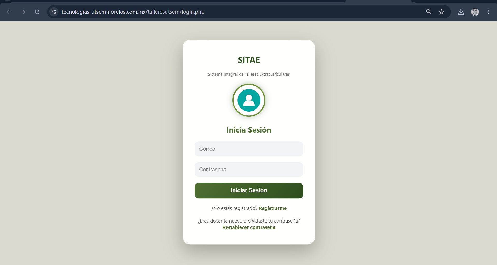
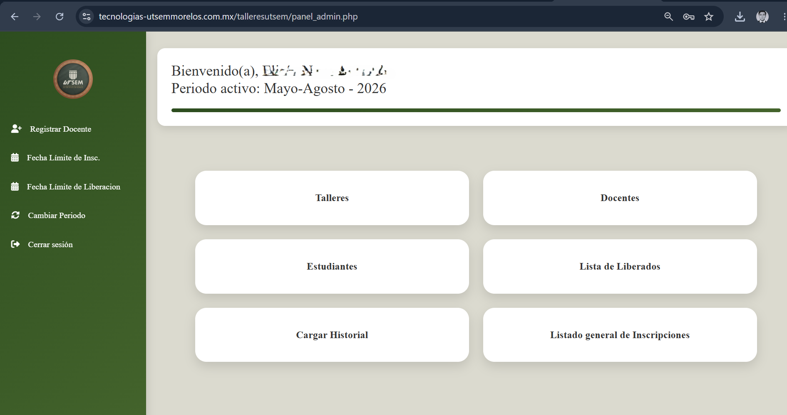
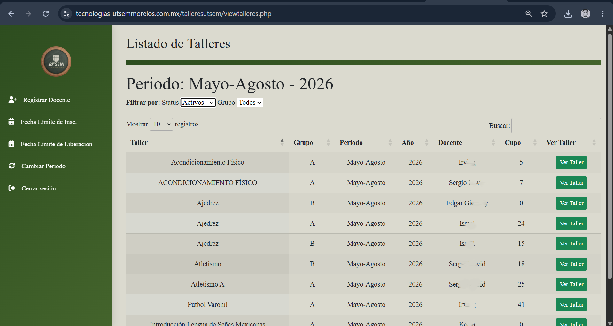
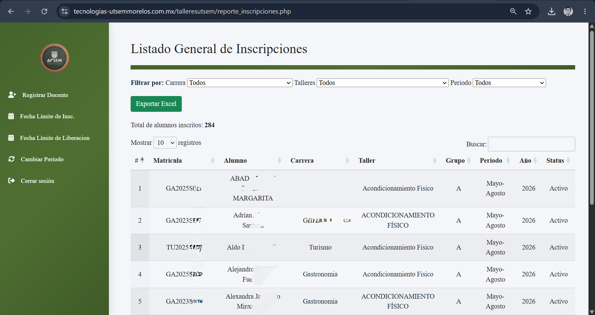

# Sistema de Gestión de Talleres

Sistema Integral de Talleres Extracurriculares (SITAE) para la Universidad Tecnologica del Sur del Estado De Morelos desarrollado en PHP y MySQL. Permite gestionar alumnos, docentes, talleres e inscripciones mediante un panel administrativo.

---

## Características

- Gestión de alumnos.
- Gestión de docentes.
- Gestión de talleres.
- Inscripción de alumnos a talleres.
- Panel de administración.
- Inicio de sesión por roles.
- Importación de datos desde Excel.
- Diseño responsive.
- Despliegue con Docker.

---

## Tecnologías

- PHP 8.2
- MySQL 8
- HTML5
- CSS3
- JavaScript
- Docker
- Docker Compose
- Apache

---

## Requisitos

- Docker
- Docker Compose
- Git

---

## Instalación

### 1. Clonar el repositorio

```bash
git clone https://github.com/Jardon27-04/SITAE_Docker
```

### 2. Entrar al proyecto

```bash
cd Docker-SITAE
```

### 3. Iniciar los contenedores

```bash
docker compose up -d
```

### 4. Abrir el navegador

```
http://localhost:8080
```

---

## Estructura del proyecto

```
├── css/
├── js/
├── img/
├── php/
├── docker-compose.yml
├── Dockerfile
└── README.md
```

---
## Capturas del sistema

### Inicio de sesión



### Panel administrativo



### Historial de talleres



### Historial de inscripciones



Por seguridad de datos sensibles, se cubren algunos nombres y apellidos de las capturas de pantalla.
---

## Autor

**Jesus Eduardo Denova Jardon**

GitHub: https://github.com/Jardon27-04/SITAE_Docker